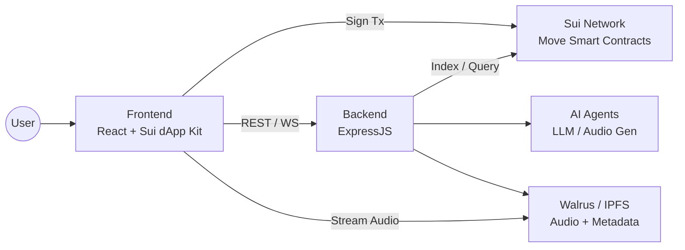
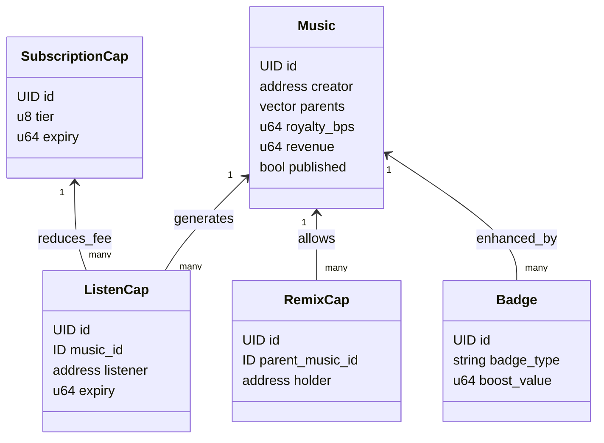
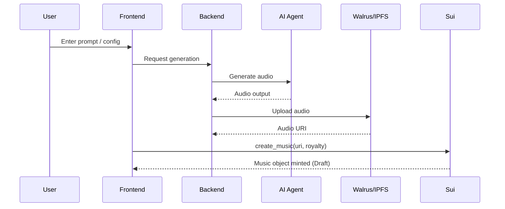
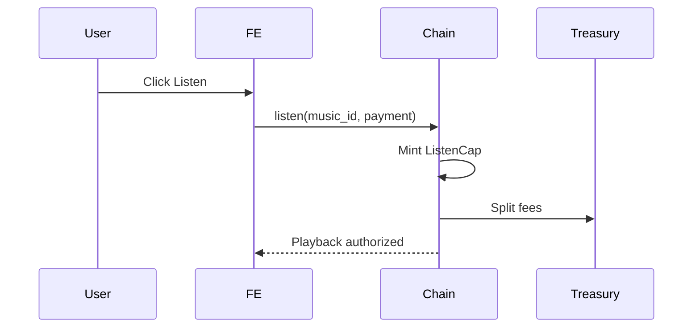
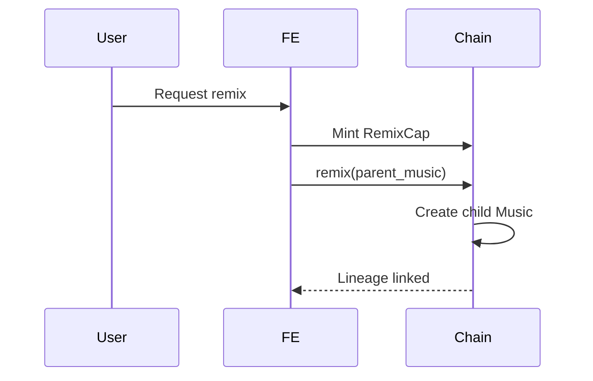
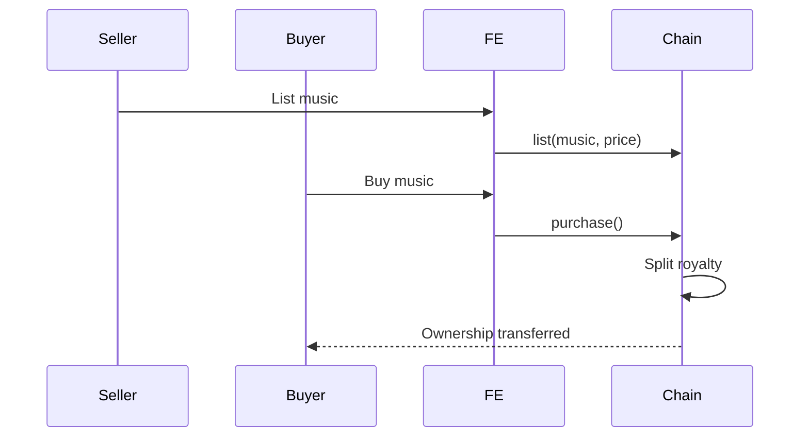
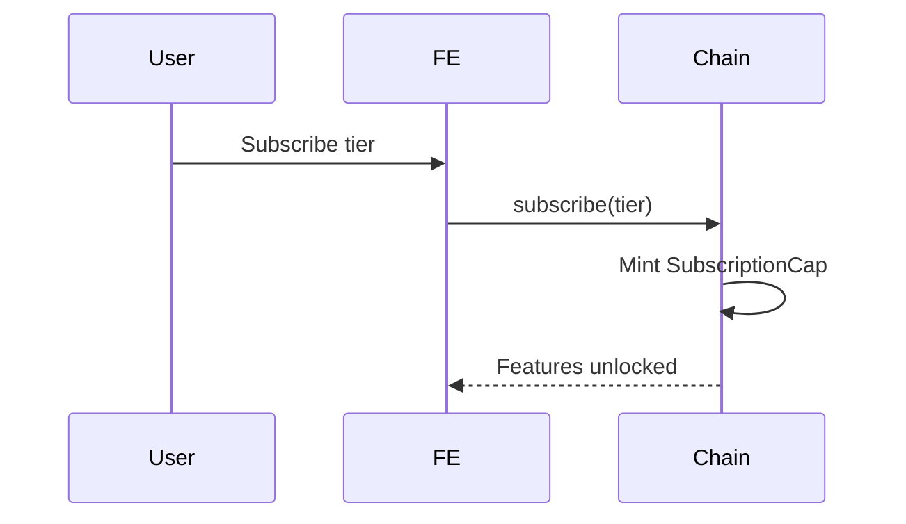
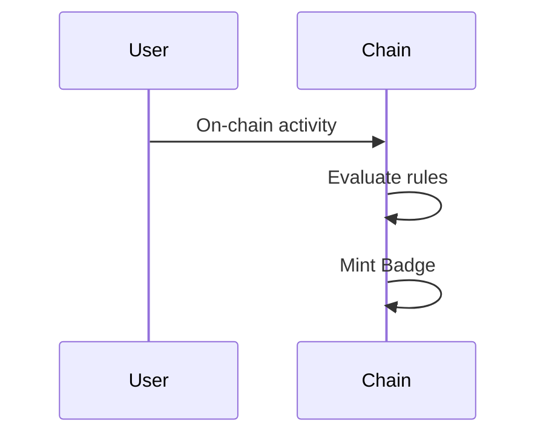

# 🎵 Sui AI Music Ownership dApp

> **Developer Edition – Living Document**
> This README is designed so a dev team can **directly implement**, **extend**, and **iterate** on the platform.

---

## 0. Purpose of this README

This document serves as:

* 📘 **Technical blueprint** for FE / BE / Move developers
* 🧠 **Business logic reference** (ownership, monetization, gamification)
* 🧩 **Open architecture guide** – easy to extend, replace, or upgrade modules

Non-goals:

* Not a marketing doc
* Not a final spec (rules may evolve)

---

## 1. Project Vision

A decentralized GenAI music platform on **Sui** where:

* Music is generated by AI
* Music becomes an on-chain asset
* Attention generates cashflow
* Ownership and derivatives are composable

> **Music is a living on-chain asset with provenance, cashflow, and derivatives.**

Target users:

* 🎼 Creators (AI-native musicians)
* 🎧 Listeners
* 💰 Investors / Curators

---

## 2. High-level Architecture

```
┌──────────────────┐        ┌──────────────────┐
│    Frontend      │◀──────▶│   Sui Network    │
│    (React)       │        │   (Move SC)     │
└────────▲─────────┘        └────────▲─────────┘
         │                              │
         │                              │
┌────────┴─────────┐        ┌──────────┴──────────┐
│     Backend       │◀──────▶│     AI Agents       │
│   (ExpressJS)     │        │ (LLM / Audio Gen)  │
└──────────────────┘        └─────────────────────┘
```

---

## 3. Responsibility Split

### 3.1 Frontend (React)

**Responsibilities**:

* Wallet connection & account state
* Transaction creation & signing
* Music workspace (create, remix)
* Music playback (encrypted audio)
* Marketplace UI
* Gamification UX (badges, levels)

**Key libraries**:

* `@mysten/dapp-kit` – wallet & tx signing
* `@mysten/sui/client`, `@mysten/sui/transactions`
* `@mysten/enoki` – identity / session (optional)
* `@mysten/payment-kit` – payment UX abstraction
* `@tanstack/react-query` – on-chain/off-chain data
* `tailwindcss`, `shadcn/ui`, `lucide-react`
* `howler.js`, `wavesurfer.js`
* `axios`

⚠️ FE never holds private keys or funds.

---

### 3.2 Move Smart Contracts

**Responsibilities**:

* Asset ownership
* Monetization logic
* Royalty enforcement
* Capability-based access control
* Treasury accounting

**Key concepts**:

* Asset-centric design (Sui-native)
* Capabilities instead of roles
* No off-chain trust assumptions

**Privacy layer**:

* SEAL for encrypted content access

---

### 3.3 Backend (ExpressJS)

**Responsibilities**:

* AI orchestration
* Prompt processing
* Metadata caching
* Indexing on-chain state

**Non-responsibilities**:

* ❌ No custody of user funds
* ❌ No ownership authority

**Tech stack**:

* ExpressJS
* PostgreSQL / Supabase (optional)
* Walrus / IPFS SDK

---

### 3.4 AI Agents

**Responsibilities**:

* Text → Audio
* Image → Prompt → Audio
* Remix generation

**Suggested stack**:

* LLM: OpenAI / Gemini
* Audio API: Suno, AudioCraft, Riffusion

---

## 4. On-chain Module Architecture (MVP)

```
move/
├── music.move         // Core music asset
├── listen.move        // Pay-to-listen & ListenCap
├── remix.move         // Remix & lineage
├── subscription.move  // Tier & access control
├── marketplace.move  // Buy/sell & royalty
├── badge.move         // Gamification
└── treasury.move     // Platform economy
```

### Module Design Rules

* `music` MUST NOT depend on marketplace or listen
* Caps are transferable only if intended
* Each module owns its invariants

---

## 5. Core On-chain Objects

### Music

* Represents a song
* Ownable, tradable
* Has revenue pool
* Supports parent (remix)

### ListenCap

* Minted per listen
* Time-bounded
* Used for access & gamification

### RemixCap

* Grants permission to remix
* Enforces derivative rules

### SubscriptionCap

* Tiered access
* Anti-sybil primitive

### Badge

* Reputation & boosts
* Can be bound to Music or User

---

## 6. Core Business Flows

### 6.1 Music Creation

```
User → AI Gen → Upload Audio → create_music()
                         → Music(Draft)
                         → publish()
```

Rules:

* Royalty capped
* Draft music not monetized

---

### 6.2 Listening & Monetization

```
listen() → Pay SUI → Mint ListenCap
        → Split fee:
            - Music pool
            - Treasury
            - Parent (if remix)
```

Anti-abuse:

* ListenCap expiry
* Subscription gating

---

### 6.3 Subscription

* Free / Creator / Pro / Investor tiers
* Fee reduction
* Feature unlock

---

### 6.4 Remix

* Requires RemixCap
* New Music inherits parent
* Parent auto-royalty

---

### 6.5 Marketplace

* List → Buy → Transfer
* Royalty auto-split
* Badge follows Music

---

### 6.6 Gamification

* Badges from on-chain activity
* Boost discoverability
* Unlock features

---

## 7. Backend Architecture (ExpressJS)

```
backend/
├── src/
│   ├── controllers/   // HTTP handlers
│   ├── services/      // AI, storage, indexer
│   ├── routes/
│   ├── jobs/          // sync on-chain
│   └── app.js
```

---

## 8. Frontend Architecture

```
frontend/
├── pages/
├── components/
├── lib/        // sui, audio, seal
├── services/
└── stores/
```

---

## 9. MVP Scope

### Included

* AI music creation
* On-chain publishing
* Pay-to-listen
* Remix
* Marketplace
* Subscription
* Basic gamification

### Excluded (by design)

* Token
* DAO
* Fractional ownership

---

## 10. Open Extension Points

Designed to extend:

* New AI providers
* New monetization models
* DAO governance
* DeFi primitives

---

## 11. Development Guidelines

* Prefer composability over optimization
* Keep core logic on-chain
* Move fast in off-chain layers
* Avoid premature DAO/token

---

## 12. Status

🚧 MVP architecture ready for development

---

## 13. UML & System Diagrams

This section provides **visual references** for architecture and core flows. Diagrams are written in **Mermaid** so they can be rendered directly in GitHub / Markdown tools.

---

### 13.1 System Architecture (Component Diagram)



---

### 13.2 On-chain Object Model (UML-style)



---

### 13.3 Music Creation Sequence



---

### 13.4 Pay-to-Listen Flow



---

### 13.5 Remix & Derivative Flow



---

### 13.6 Marketplace & Ownership Transfer



---

### 13.7 Subscription & Access Control



---

### 13.8 Gamification & Badge Minting



---

> **Note**: These diagrams are intended as a living reference. Developers are encouraged to update them as modules evolve.

---

> **This protocol turns music into a programmable financial primitive.**
